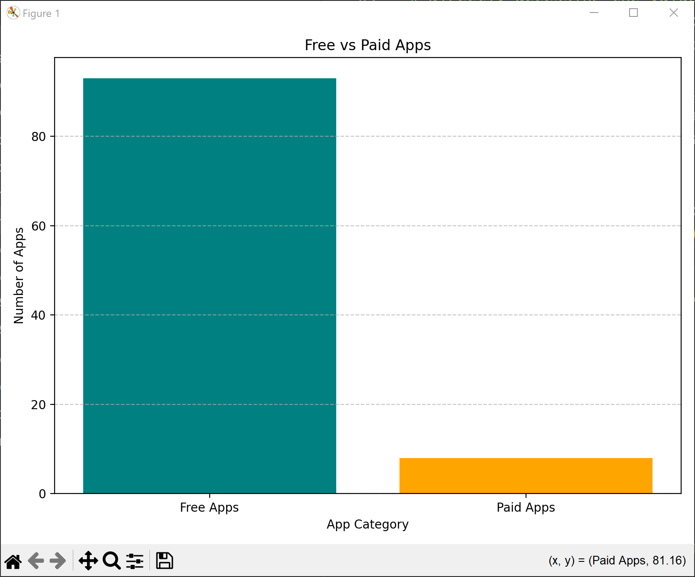
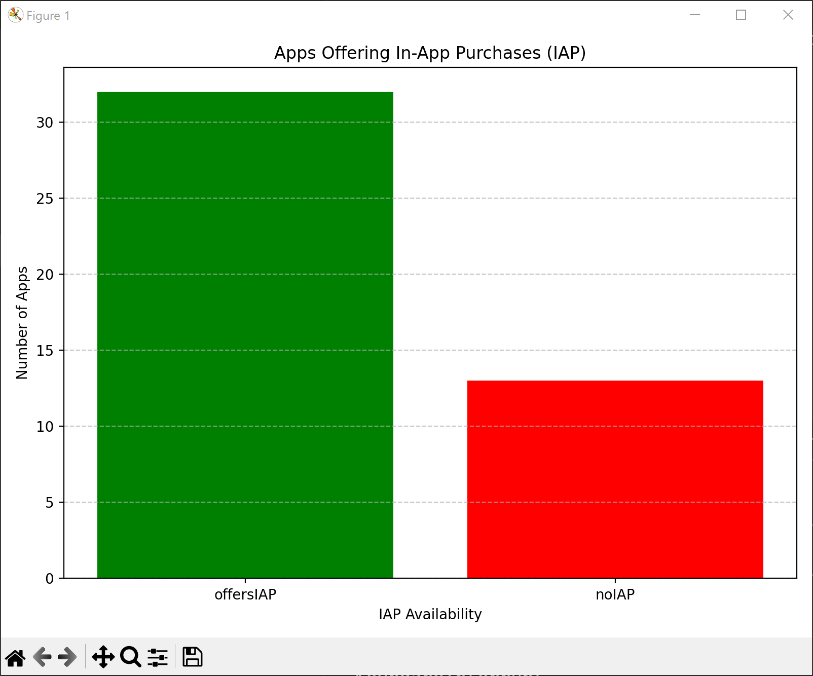
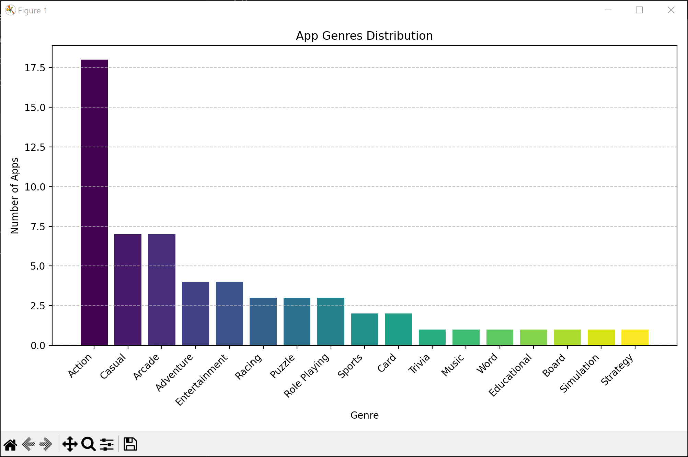
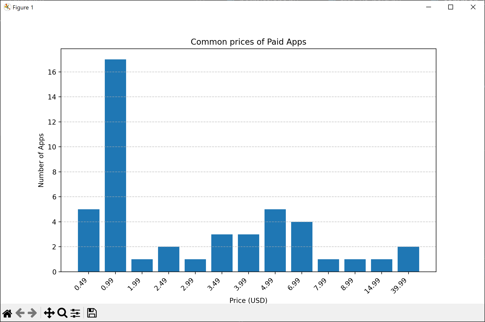
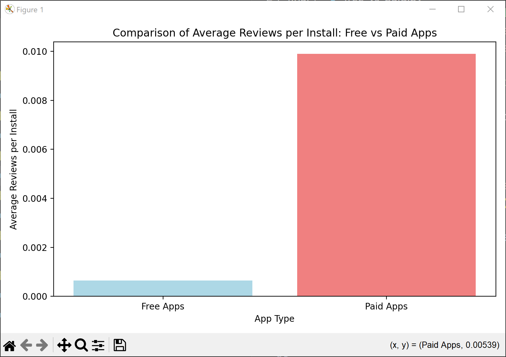
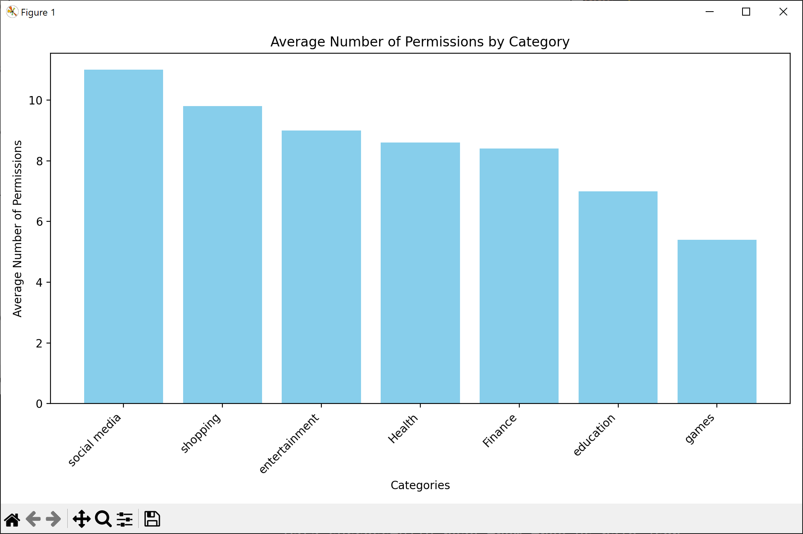

# PlayStore Datahub

## Project Members:
- Sreevani Singam  
- Srikar Bokka  
- Niharika Kompally  
- Yaswanth Nadavadi  
- Venkata Sai Charan Menta  

## Project Goal:
The **PlayStore Datahub** project aims to automate the process of retrieving app data from the Google Play Store.  
It allows for analyzing and comparing trends such as free vs paid apps and visualizing insights through graphs.  
Manually collecting app store data is slow and error-prone, but our project simplifies the process by automating data collection and analysis.

## Features & Insights:
### Free vs Paid Apps:
- Compares the number of free and paid apps in the pulled data.

### In-App Advertisements (IAP):
- Highlights the number of apps with and without in-app advertisements.

### App Genres:
- Categorizes apps based on their genres using keywords.

### Common Prices:
- Displays the most common pricing for paid apps.

### Average Reviews:
- Shows the average number of reviews given by users per install.

### Permissions:
- Identifies app categories that request the most permissions.

## Prerequisites:
Before running the scripts, ensure you have the following installed:

1. **Google Play Scraper**  
Automatically collects app data from the Google Play Store.  

```
pip install google-play-scraper
```

2. **Pandas**  
Organizes data into tables (data frames) for easy filtering.

```
pip install pandas
```

3. **JSON**  
Saves collected data in a structured and readable format.

```
pip install json
```

4. **Matplotlib**  
Visualizes insights using bar and gradient graphs.

```
pip install matplotlib
```

5. **NumPy**  
Generates evenly spaced values for colormap mapping.

```
pip install numpy
```

## Getting Started:
1. Clone this repository using git:  
```
git clone https://github.com/srikar2077/gta5-modding-utils
```

or download the code as a ZIP file
```
https://github.com/srikar2077/google-scraper-analysis/archive/refs/heads/main.zip
```

2. Navigate to your project directory and run the desired scripts using:

```
cd <project_path>
python <filename.py>
```

### Example:
```
python free_vs_paid.py
python IAP.py
python genres.py
python common_prices.py
python avg_reviews.py
python permissions.py
```

## Sample Visualizations:
### Free vs Paid Apps:

### In-App Advertisements (IAP):

### App Genres:

### Common Prices:

### Average Reviews:

### Permissions:
